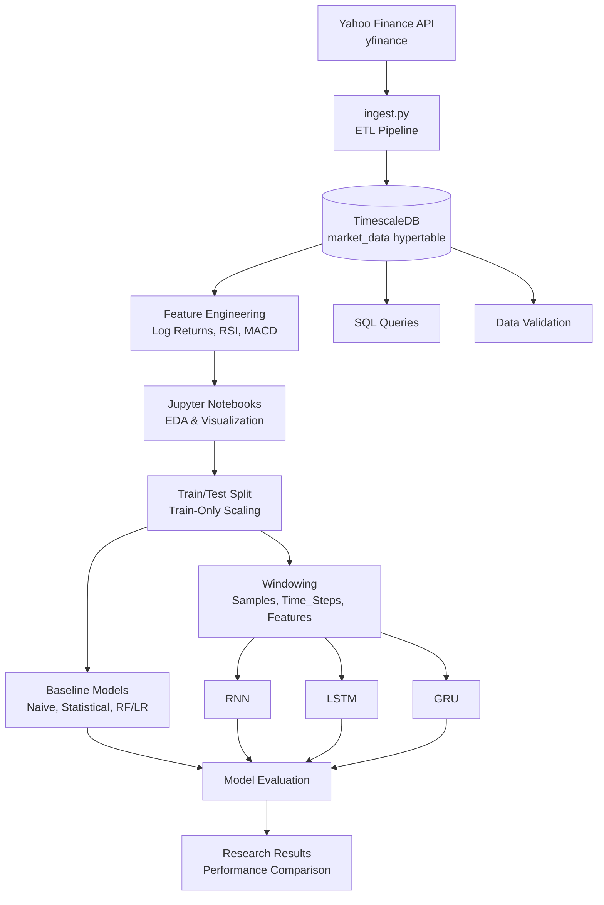

# chronos-market
A rigorous study on time-series forecasting using Deep Learning, featuring an end-to-end data pipeline with TimescaleDB, feature engineering, and a comparative analysis of RNN, LSTM, and GRU architectures on financial asset price prediction.

## Current Development Status
- **Pipeline Status:** [Operational]
- **Last Updated:** July 1, 2026
- **Data Ingestion:** Complete — idempotent pipeline from `yfinance` into TimescaleDB.
- **Feature Engineering:** Complete — log returns, RSI, MACD, leak-free train/test scaling.
- **Current Focus:** Baseline models (naive, statistical, RF/LR) and windowing for RNN input, ahead of LSTM/GRU architecture work.

## Tech Stack & Architecture

This project is built using an industry-standard stack designed for reproducible, scalable time-series research. By leveraging containerization and optimized database schemas, the architecture ensures that the "Chronos-Market" framework remains modular and professional.

### Technical Components

| Layer | Technology | Purpose |
| :--- | :--- | :--- |
| **Language** | Python 3.13.9 | Data ingestion, feature engineering, and model training. |
| **Data Source** | `yfinance` | Automated API retrieval of historical market data. |
| **Database** | TimescaleDB | PostgreSQL-based time-series storage with hypertable partitioning. |
| **DB Driver** | `SQLAlchemy` | ORM and database adapter for secure, robust SQL operations. |
| **Infrastructure**| Docker & Docker Compose | Containerized database environment ensuring environment parity. |
| **ML / Stats** | scikit-learn, pandas_ta | Technical indicators, scaling, baseline regression models. |
| **Analysis** | Jupyter Notebooks | Interactive Exploratory Data Analysis (EDA) and visualization. |
| **Version Control**| Git / GitHub | Documenting the iterative research process. |

### Architectural Workflow

### Why this stack?

* **TimescaleDB vs. Standard SQL:** While standard PostgreSQL handles relational data well, the `hypertable` abstraction in TimescaleDB provides native time-partitioning. This significantly optimizes performance when calculating complex sliding-window financial indicators (like 50-day Moving Averages) across large datasets.
* **Infrastructure as Code (IaC):** By using `docker-compose.yml`, the entire backend—including the database and its specific extensions—is abstracted away. This ensures that the environment is "plug-and-play," allowing for seamless deployment and testing.
* **Research Integrity:** The project utilizes a strict Virtual Environment and `requirements.txt` workflow. This ensures that the development environment is isolated and reproducible, which is critical for verifying model performance metrics across different experimental iterations.

### Design Principles

* **Idempotent Ingestion:** The `src/ingest.py` script is designed to be re-runnable without duplicating records, ensuring database consistency.
* **Separation of Concerns:** Data storage logic (SQL) is kept distinct from analytical logic (Jupyter), allowing the model to query "feature-ready" data directly from the database rather than relying on brittle local CSVs.
* **No Data Leakage:** All scalers and statistical baselines are fit exclusively on the training partition (chronological split, no shuffling) and only ever applied — never re-fit — to the test partition.

## Research Journal: Project Stages

### Stage 1: Foundation & Data Pipeline (COMPLETED)
- [x] Environment setup (Virtual Env, Python 3.13)
- [x] Database containerization (TimescaleDB via Docker)
- [x] Data ingestion pipeline (`yfinance` to PostgreSQL)
- [x] Resolved schema/column mapping issues
- [x] Verified data integrity via SQL queries

### Stage 2: Feature Engineering (COMPLETED)
- [x] Log returns computed (replacing simple returns) for stationarity
- [x] Technical indicators added: RSI(14), MACD(12,26,9)
- [x] Visual stationarity check on log returns
- [x] Chronological 80/20 train/test split
- [x] Train-only `MinMaxScaler` fit, persisted for reuse across notebooks

### Stage 3: Baseline Models (IN PROGRESS)
- [x] Baseline notebook initialized; scaler reuse and target scaling wired in
- [ ] Naive baseline (yesterday = today)
- [ ] Statistical baseline (20-day rolling average)
- [ ] ML baselines: Linear Regression, Random Forest on lagged features
- [ ] Baseline benchmark table (MAE/MSE) saved to `results/`
- [ ] Windowing function for `(Samples, Time_Steps, Features)` RNN input
- [ ] Modularize preprocessing into `scripts/preprocess.py`

### Stage 4: RNN / LSTM / GRU Architecture (UPCOMING)
- [ ] LSTM baseline architecture
- [ ] GRU comparison
- [ ] Hyperparameter tuning
- [ ] Performance comparison against Stage 3 benchmarks