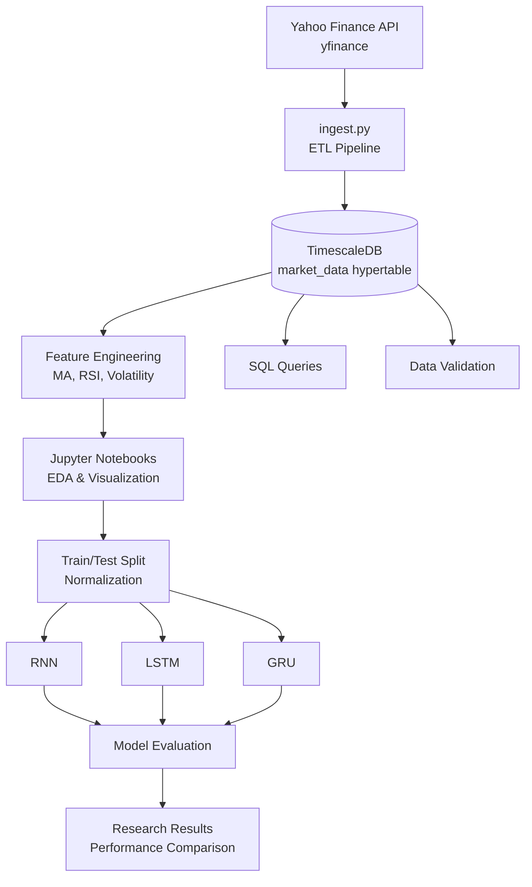

# chronos-market
A rigorous study on time-series forecasting using Deep Learning, featuring an end-to-end data pipeline with TimescaleDB, feature engineering, and a comparative analysis of RNN, LSTM, and GRU architectures on financial asset price prediction.

## Current Development Status
- **Pipeline Status:** [Operational] 
- **Last Updated:** June 20, 2026
- **Week 1 Milestone:** Successfully engineered an idempotent data ingestion pipeline.
- **Current Focus:** Moving into Week 2 (Exploratory Data Analysis).

## Tech Stack & Architecture

This project is built using an industry-standard stack designed for reproducible, scalable time-series research. By leveraging containerization and optimized database schemas, the architecture ensures that the "Chronos-Market" framework remains modular and professional.

### Technical Components

| Layer | Technology | Purpose |
| :--- | :--- | :--- |
| **Language** | Python 3.13.9 | Data ingestion, feature engineering, and model training. |
| **Data Source** | `yfinance` | Automated API retrieval of historical market data. |
| **Database** | TimescaleDB | PostgreSQL-based time-series storage with hypertable partitioning. |
| **DB Driver** | `psycopg2` & `SQLAchemy` | ORM and database adapter for secure, robust SQL operations. |
| **Infrastructure**| Docker & Docker Compose | Containerized database environment ensuring environment parity. |
| **Analysis** | Jupyter Notebooks | Interactive Exploratory Data Analysis (EDA) and visualization. |
| **Version Control**| Git / GitHub | Documenting the 4-week iterative "Research Journal." |

### Architectural Workflow

### Why this stack?

* **TimescaleDB vs. Standard SQL:** While standard PostgreSQL handles relational data well, the `hypertable` abstraction in TimescaleDB provides native time-partitioning. This significantly optimizes performance when calculating complex sliding-window financial indicators (like 50-day Moving Averages) across large datasets.
* **Infrastructure as Code (IaC):** By using `docker-compose.yml`, the entire backend—including the database and its specific extensions—is abstracted away. This ensures that the environment is "plug-and-play," allowing for seamless deployment and testing.
* **Research Integrity:** The project utilizes a strict Virtual Environment and `requirements.txt` workflow. This ensures that the development environment is isolated and reproducible, which is critical for verifying model performance metrics across different experimental iterations.

### Design Principles

* **Idempotent Ingestion:** The `src/ingest.py` script is designed to be re-runnable without duplicating records, ensuring database consistency.
* **Separation of Concerns:** Data storage logic (SQL) is kept distinct from analytical logic (Jupyter), allowing the model to query "feature-ready" data directly from the database rather than relying on brittle local CSVs.
* **Modular Evolution:** The repository structure is organized to support the "Model Evolution" methodology, where experiments (`exp_01`, `exp_02`, etc.) are tracked and versioned against a consistent baseline.

## Research Journal: Weekly Iterations

### Week 1: Foundation & Data Pipeline (COMPLETED)
- [x] Environment setup (Virtual Env, Python 3.13)
- [x] Database containerization (TimescaleDB via Docker)
- [x] Data ingestion pipeline (`yfinance` to PostgreSQL)
- [x] Resolved schema/column mapping issues
- [x] Verified data integrity via SQL queries

### Week 2: Exploratory Data Analysis (UP NEXT)
- [ ] Feature engineering (Moving Averages, RSI, Volatility)
- [ ] Correlation analysis between price and volume
- [ ] Stationary testing and data normalization